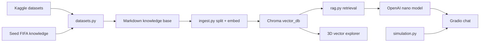

# FIFA World Cup 2026 RAG Assistant


> **Tags:** `LLMs` · `RAG` · `Embeddings` · `Vector Stores` · `LangChain` · `Chroma` · `OpenAI` · `Gradio` · `Plotly` · `KaggleHub` · `Simulation` · `Prompt Engineering`

A project scaffold inspired by `applied-llm-engineering`: offline ingestion, Chroma vector storage, retrieval-augmented
answers, a conversational UI, suggested test questions, projection helpers, and a 3D view
of the embeddings.

## What It Builds

- A Gradio chat assistant for FIFA World Cup 2026 questions.
- A Kaggle-powered knowledge-base ingestion flow.
- A Chroma vector database using OpenAI embeddings.
- A 3D Plotly projection of stored vectors so users can see how chunks cluster.
- A small scenario simulator for group-stage advancement experiments.
- Evidence panels that show which chunks grounded each answer.

The default chat model is `gpt-5.4-nano`, based on the OpenAI model docs available on
2026-05-31. Set `OPENAI_MODEL=gpt-5-nano` or `OPENAI_MODEL=gpt-4.1-nano` if your account
does not have access yet.

## Data Sources

The source datasets come from Kaggle and credit belongs to the Kaggle users who published
them:

- `sarazahran1/wc2026-match-probability-baseline-dataset`:
  <https://www.kaggle.com/datasets/sarazahran1/wc2026-match-probability-baseline-dataset>
- `areezvisram12/fifa-world-cup-2026-match-data-unofficial`:
  <https://www.kaggle.com/datasets/areezvisram12/fifa-world-cup-2026-match-data-unofficial>
- `harrachimustapha/fifa-world-cup-team-dataset`:
  <https://www.kaggle.com/datasets/harrachimustapha/fifa-world-cup-team-dataset>

For day-to-day development, this project reads downloaded copies from `data/raw/` instead
of pulling directly from Kaggle every time. Keeping local copies avoids network connection
issues, Kaggle authentication interruptions, rate limits, and changing remote availability
while still preserving the original Kaggle attribution above.

The repo also writes a small seed knowledge file with current tournament-format notes and
links to official FIFA schedule references. Because fixtures and qualified teams can change,
refresh ingestion before demos.

The ingestion script reads local files first and only tries KaggleHub when no local raw
files are present. See `data/README.md` for the expected local folder names and file
meanings.

## Quick Start

```bash
python3 -m venv .venv
source .venv/bin/activate
pip install --upgrade pip
pip install -e ".[dev]"
cp .env.example .env
```

Add your `OPENAI_API_KEY` to `.env`, then build the knowledge base and vector store:

```bash
wc2026-ingest
```

If Kaggle credentials are not configured yet, ingestion will still index the built-in FIFA
seed knowledge and write a warning file. That seed knowledge includes the tournament start
date and Mexico's currently listed Group A fixtures, so the first chat demo should work even
before the Kaggle datasets are available.

Run the app:

```bash
python3 src/wc2026_rag/app.py
```

or with the console script:

```bash
wc2026-app
```

## Suggested Demo Questions

- When are Mexico's group-stage games scheduled?
- Which teams are most likely to advance from the group stage?
- Simulate a likely path from group stage to the final.
- What team could be the surprise of this World Cup?
- What evidence did you retrieve for that answer?
- Which dataset fields look useful for match projections?
- Explain how the vector store was created.

## Local Checks

```bash
python3 -m compileall src tests
pytest
```

## Architecture



## Course Mapping

- Week Four influence: clear app packaging, model configuration, and user-facing interface.
- Week Five influence: RAG split into ingestion and answering, Chroma persistence, source
  metadata, retrieved-context display, and room for advanced retrieval/reranking.

## Notes For Next Iteration

- Add an evaluator set similar to Week Five's `tests.jsonl`.
- Add query rewriting and reranking from the advanced RAG lecture once baseline answers work.
- Normalize team names across all three datasets before using probability fields.
- Add bracket-level Monte Carlo simulation after group data is confirmed.
