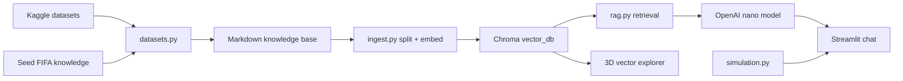

# FIFA World Cup 2026 RAG Assistant

A project scaffold inspired by Week Four and especially Week Five of
`applied-llm-engineering`: offline ingestion, Chroma vector storage, retrieval-augmented
answers, a conversational UI, suggested test questions, projection helpers, and a 3D view
of the embeddings.

## What It Builds

- A Gradio chat assistant for FIFA World Cup 2026 questions.
- A Kaggle-powered knowledge-base ingestion flow.
- A Chroma vector database using OpenAI embeddings.
- A 3D Plotly projection of stored vectors so users can see how chunks cluster.
- A small scenario simulator for group-stage advancement experiments.
- Evidence panels that show which chunks grounded each answer.

The default chat model is `gpt-5.4-nano`, based on the OpenAI model docs available on
2026-05-31. Set `OPENAI_MODEL=gpt-5-nano` or `OPENAI_MODEL=gpt-4.1-nano` if your account
does not have access yet.

## Data Sources

Configured Kaggle datasets:

- `sarazahran1/wc2026-match-probability-baseline-dataset`
- `areezvisram12/fifa-world-cup-2026-match-data-unofficial`
- `harrachimustapha/fifa-world-cup-team-dataset`

The repo also writes a small seed knowledge file with current tournament-format notes and
links to official FIFA schedule references. Because fixtures and qualified teams can change,
refresh ingestion before demos.

## Quick Start

```bash
python -m venv .venv
source .venv/bin/activate
pip install -e ".[dev]"
cp .env.example .env
```

Add your `OPENAI_API_KEY` to `.env`, then build the knowledge base and vector store:

```bash
wc2026-ingest
```

Run the app:

```bash
python src/wc2026_rag/app.py
```

or with the console script:

```bash
wc2026-app
```

## Suggested Demo Questions

- When are Mexico's group-stage games scheduled?
- Which teams are most likely to advance from the group stage?
- Simulate a likely path from group stage to the final.
- What evidence did you retrieve for that answer?
- Which dataset fields look useful for match projections?
- Explain how the vector store was created.

## Architecture



## Course Mapping

- Week Four influence: clear app packaging, model configuration, and user-facing interface.
- Week Five influence: RAG split into ingestion and answering, Chroma persistence, source
  metadata, retrieved-context display, and room for advanced retrieval/reranking.

## Notes For Next Iteration

- Add an evaluator set similar to Week Five's `tests.jsonl`.
- Add query rewriting and reranking from the advanced RAG lecture once baseline answers work.
- Normalize team names across all three datasets before using probability fields.
- Add bracket-level Monte Carlo simulation after group data is confirmed.
